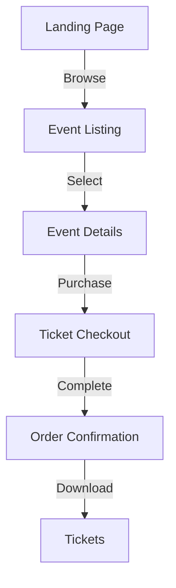

# Prompt: Fashionistas Platform Sitemap Documentation

Create a comprehensive sitemap document for the Fashionistas events platform that outlines the complete website structure, user flows, and content organization. The document should serve as a blueprint for development and ensure optimal user experience for all stakeholders.

## Document Structure

### 1. Overview (20-30 lines)

Describe the high-level organization of the platform, including:
- Primary user roles (Event organizers, Sponsors, Designers, Attendees)
- Core feature sections
- Navigation hierarchy
- Access levels
- Localization approach (Spanish/English)

### 2. Public Pages (30-40 lines)

Detail the structure of public-facing pages:

```typescript
interface PublicPages {
  home: {
    sections: [
      'featured-events',
      'upcoming-shows',
      'sponsor-showcase',
      'designer-spotlight'
    ];
    components: [
      'hero-slider',
      'event-grid',
      'sponsor-carousel'
    ];
  };
  events: {
    listing: {
      filters: ['date', 'type', 'price', 'location'];
      views: ['grid', 'calendar', 'map'];
    };
    detail: {
      sections: [
        'event-info',
        'ticket-options',
        'designer-info',
        'sponsor-area'
      ];
    };
  };
  designers: {
    directory: string[];
    portfolios: string[];
    collections: string[];
  };
  sponsors: {
    opportunities: string[];
    success_stories: string[];
    contact: string[];
  };
}
```

### 3. Authenticated Areas (40-50 lines)

Define protected sections based on user roles:

```typescript
interface AuthenticatedAreas {
  eventOrganizer: {
    dashboard: string[];
    eventManagement: {
      creation: string[];
      ticketing: string[];
      analytics: string[];
    };
    sponsorTools: string[];
  };
  sponsor: {
    portal: string[];
    activations: string[];
    analytics: string[];
  };
  designer: {
    portfolio: string[];
    events: string[];
    metrics: string[];
  };
  attendee: {
    profile: string[];
    tickets: string[];
    favorites: string[];
  };
}
```

### 4. Feature Modules (30-40 lines)

Detail the organization of core features:

```typescript
interface FeatureModules {
  ticketing: {
    purchase: string[];
    management: string[];
    validation: string[];
  };
  sponsorship: {
    opportunities: string[];
    applications: string[];
    management: string[];
  };
  communication: {
    notifications: string[];
    messaging: string[];
    updates: string[];
  };
  analytics: {
    reports: string[];
    dashboards: string[];
    exports: string[];
  };
}
```

### 5. Navigation Structure (20-30 lines)

Define the navigation hierarchy:

```typescript
interface Navigation {
  main: {
    primary: MenuItem[];
    secondary: MenuItem[];
    footer: FooterSection[];
  };
  authenticated: {
    organizer: MenuItem[];
    sponsor: MenuItem[];
    designer: MenuItem[];
    attendee: MenuItem[];
  };
  mobile: {
    menu: MenuItem[];
    quickActions: Action[];
  };
}
```

### 6. URL Structure (20-30 lines)

Document URL patterns:

```typescript
interface URLPatterns {
  events: {
    list: '/events',
    detail: '/events/:id',
    category: '/events/category/:slug'
  };
  sponsors: {
    directory: '/sponsors',
    profile: '/sponsors/:id',
    opportunities: '/sponsors/opportunities'
  };
  designers: {
    list: '/designers',
    portfolio: '/designers/:id',
    collections: '/designers/:id/collections'
  };
  auth: {
    login: '/auth/login',
    register: '/auth/register',
    reset: '/auth/reset-password'
  };
}
```

### 7. Content Areas (30-40 lines)

Define content organization:

```typescript
interface ContentAreas {
  marketing: {
    landingPages: string[];
    promotions: string[];
    blog: string[];
  };
  support: {
    faq: string[];
    helpCenter: string[];
    contact: string[];
  };
  legal: {
    terms: string[];
    privacy: string[];
    cookies: string[];
  };
  resources: {
    guides: string[];
    documentation: string[];
    downloads: string[];
  };
}
```

### 8. Integration Points (20-30 lines)

Document integration touchpoints:

```typescript
interface IntegrationPoints {
  hiEvents: {
    eventSync: string[];
    ticketing: string[];
  };
  twentyCRM: {
    sponsorData: string[];
    leads: string[];
  };
  whatsapp: {
    notifications: string[];
    updates: string[];
  };
  stripe: {
    checkout: string[];
    subscriptions: string[];
  };
  cloudinary: {
    assets: string[];
    galleries: string[];
  };
}
```

### 9. User Flows (30-40 lines)

Detail key user journeys:



### 10. Mobile Considerations (20-30 lines)

Define mobile-specific structure:
- Progressive enhancement
- Responsive breakpoints
- Touch interactions
- Mobile-specific features
- Offline capabilities
- Performance optimization
- Mobile navigation patterns
- Touch-friendly UI elements

### 11. SEO Structure (20-30 lines)

Document SEO organization:
- URL hierarchy
- Meta data structure
- Sitemap.xml format
- Structured data implementation
- Local SEO considerations
- Multi-language support
- Social media integration
- Rich snippets implementation

## Required Deliverables

1. **Visual Sitemap**
   - Complete hierarchical diagram
   - User role overlays
   - Integration points
   - Content relationships
   - Mobile navigation flows
   - SEO structure visualization

2. **URL Documentation**
   - Complete URL listing
   - Parameter specifications
   - Redirect rules
   - SEO guidelines
   - Canonical URL patterns
   - Language variations

3. **Navigation Specs**
   - Menu structures
   - User role access
   - Mobile navigation
   - Footer organization
   - Breadcrumb patterns
   - Search integration

4. **Content Matrix**
   - Page types
   - Content ownership
   - Update frequency
   - Required metadata
   - SEO requirements
   - Multi-language support

## Success Criteria

1. **Usability**
   - Clear navigation paths
   - Logical content grouping
   - Intuitive user flows
   - Role-appropriate access
   - Mobile-first design
   - Accessibility compliance

2. **Technical**
   - SEO-friendly structure
   - Performance optimization
   - Integration support
   - Mobile optimization
   - Security considerations
   - Scalability support

3. **Business**
   - Support for all user types
   - Marketing effectiveness
   - Analytics capability
   - Growth scalability
   - Revenue optimization
   - User engagement

The final sitemap documentation should provide a clear blueprint for development while ensuring optimal user experience and business goal achievement. The structure should be flexible enough to accommodate future growth while maintaining consistency and usability across all platforms and user roles.
