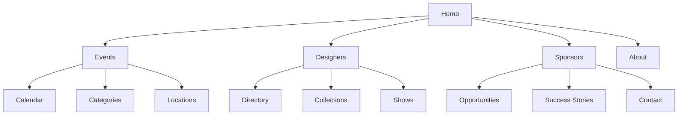
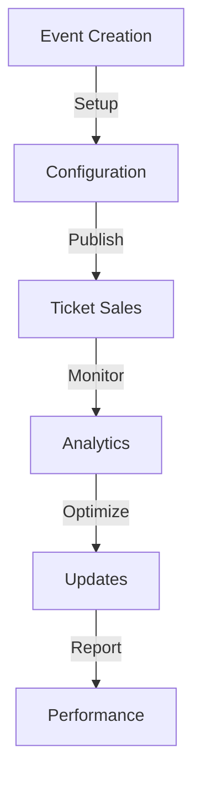
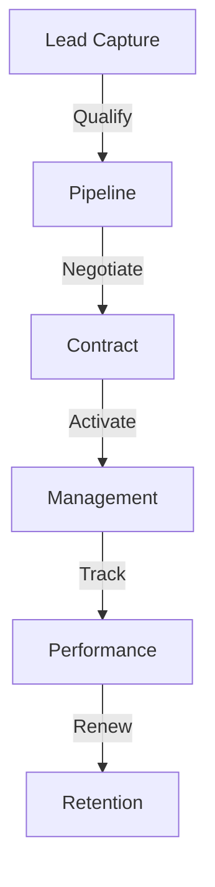
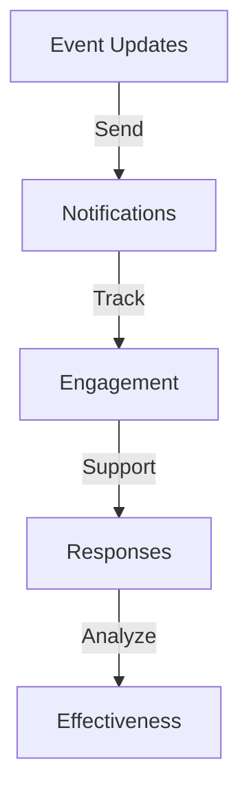

# Fashionistas Platform - Sitemap Documentation

## 1. Platform Overview

### User Roles & Access Levels

1. **Event Organizers**
   - Full event management capabilities
   - Sponsor relationship tools
   - Analytics dashboard access
   - Financial management

2. **Sponsors**
   - Sponsorship portal
   - Lead management
   - Event analytics
   - Brand asset control

3. **Designers**
   - Portfolio management
   - Show scheduling
   - Collection showcase
   - Performance metrics

4. **Attendees**
   - Event discovery
   - Ticket purchasing
   - Personal schedule
   - Social features

### Core Feature Sections

```typescript
interface CoreFeatures {
  eventManagement: {
    planning: 'Hi.Events Integration';
    ticketing: 'Stripe Integration';
    communication: 'WhatsApp Integration';
  };
  sponsorManagement: {
    crm: 'Twenty CRM Integration';
    activation: 'Custom Tools';
    analytics: 'Performance Tracking';
  };
  designerShowcase: {
    portfolio: 'Cloudinary Integration';
    scheduling: 'Calendar Management';
    metrics: 'Analytics Dashboard';
  };
  attendeeExperience: {
    discovery: 'Event Search';
    purchasing: 'Ticket System';
    engagement: 'Social Features';
  };
}
```

### Navigation Hierarchy



## 2. Public Pages Structure

### Home Page
```typescript
interface HomePage {
  hero: {
    type: 'dynamic-slider';
    content: [
      'featured-shows',
      'upcoming-events',
      'designer-spotlights'
    ];
  };
  sections: {
    featuredEvents: {
      layout: 'grid';
      items: number = 6;
      filters: ['date', 'category', 'price'];
    };
    sponsorShowcase: {
      layout: 'carousel';
      items: number = 8;
      categories: ['platinum', 'gold', 'silver'];
    };
    designerSpotlight: {
      layout: 'masonry';
      items: number = 9;
      sorting: 'latest';
    };
  };
}
```

### Event Pages
```typescript
interface EventPages {
  listing: {
    views: {
      grid: {
        columns: number = 3;
        itemsPerPage: number = 12;
      };
      calendar: {
        defaultView: 'month';
        filters: ['category', 'price', 'location'];
      };
      map: {
        clustering: true;
        filters: ['date', 'distance', 'type'];
      };
    };
    filters: {
      date: DateRangeFilter;
      price: PriceRangeFilter;
      category: MultiSelectFilter;
      location: LocationFilter;
    };
  };
  detail: {
    sections: [
      'event-header',
      'ticket-options',
      'event-details',
      'designer-info',
      'sponsor-section',
      'related-events'
    ];
    actions: [
      'buy-tickets',
      'save-event',
      'share-event',
      'contact-organizer'
    ];
  };
}
```

## 3. Authenticated Areas

### Event Organizer Dashboard
```typescript
interface OrganizerDashboard {
  overview: {
    stats: ['sales', 'revenue', 'attendance', 'engagement'];
    charts: ['trends', 'demographics', 'sources'];
    alerts: ['low-inventory', 'support-requests', 'updates'];
  };
  eventManagement: {
    creation: {
      templates: ['runway', 'showcase', 'popup', 'tradeshow'];
      workflow: ['basic', 'details', 'tickets', 'publish'];
    };
    ticketing: {
      management: ['inventory', 'pricing', 'promotions'];
      reports: ['sales', 'attendance', 'revenue'];
    };
    sponsorship: {
      tools: ['proposals', 'contracts', 'activations'];
      tracking: ['leads', 'commitments', 'deliverables'];
    };
  };
}
```

### Sponsor Portal
```typescript
interface SponsorPortal {
  dashboard: {
    overview: ['active-events', 'leads', 'roi-metrics'];
    actions: ['apply', 'manage', 'report'];
  };
  activations: {
    current: {
      events: string[];
      metrics: ['impressions', 'engagement', 'leads'];
      assets: ['logos', 'materials', 'content'];
    };
    planning: {
      opportunities: string[];
      proposals: string[];
      calendar: string[];
    };
  };
}
```

### Designer Interface
```typescript
interface DesignerInterface {
  portfolio: {
    collections: string[];
    lookbooks: string[];
    media: string[];
  };
  shows: {
    upcoming: string[];
    past: string[];
    metrics: string[];
  };
  analytics: {
    engagement: string[];
    sales: string[];
    reach: string[];
  };
}
```

## 4. Feature Modules

### Ticketing System
```typescript
interface TicketingSystem {
  purchase: {
    flow: ['selection', 'details', 'payment', 'confirmation'];
    features: ['seat-selection', 'packages', 'add-ons'];
    validation: ['qr-code', 'digital-pass', 'transfer'];
  };
  management: {
    inventory: ['allocation', 'holds', 'releases'];
    pricing: ['tiers', 'dynamic', 'discounts'];
    access: ['vip', 'general', 'industry'];
  };
}
```

### Sponsor Management
```typescript
interface SponsorManagement {
  opportunities: {
    packages: ['platinum', 'gold', 'silver', 'custom'];
    benefits: ['visibility', 'access', 'activation'];
    targeting: ['audience', 'reach', 'engagement'];
  };
  activation: {
    planning: ['timeline', 'requirements', 'assets'];
    execution: ['setup', 'monitoring', 'support'];
    reporting: ['metrics', 'roi', 'feedback'];
  };
}
```

## 5. Integration Workflows

### Hi.Events Integration


### Twenty CRM Integration


### WhatsApp Communication


## 6. Mobile Experience

### Responsive Design
```typescript
interface ResponsiveDesign {
  breakpoints: {
    mobile: '320px-767px';
    tablet: '768px-1023px';
    desktop: '1024px+';
  };
  layouts: {
    mobile: {
      navigation: 'bottom-bar';
      content: 'single-column';
      actions: 'floating-button';
    };
    tablet: {
      navigation: 'side-drawer';
      content: 'two-column';
      actions: 'inline-buttons';
    };
  };
}
```

### Mobile Features
```typescript
interface MobileFeatures {
  offline: {
    caching: ['events', 'tickets', 'content'];
    sync: ['automatic', 'manual', 'background'];
  };
  notifications: {
    types: ['event', 'ticket', 'sponsor', 'system'];
    delivery: ['push', 'in-app', 'whatsapp'];
  };
  interactions: {
    gestures: ['swipe', 'tap', 'pinch'];
    feedback: ['haptic', 'visual', 'audio'];
  };
}
```

## 7. SEO & Performance

### SEO Implementation
```typescript
interface SEOStructure {
  metadata: {
    title: string;
    description: string;
    keywords: string[];
    og: OpenGraph;
    twitter: TwitterCard;
  };
  structure: {
    urls: 'semantic-urls';
    hierarchy: 'logical-structure';
    sitemaps: ['main', 'events', 'images'];
  };
  localization: {
    hreflang: ['es-CO', 'en-US'];
    regional: ['medellin', 'bogota', 'cali'];
  };
}
```

### Performance Metrics
```typescript
interface PerformanceTargets {
  loading: {
    firstPaint: '< 1s';
    interactive: '< 2s';
    complete: '< 3s';
  };
  interaction: {
    response: '< 100ms';
    animation: '60fps';
    scroll: 'smooth';
  };
  availability: {
    uptime: '99.9%';
    errorRate: '< 0.1%';
    recovery: 'automatic';
  };
}
```

## Success Metrics

### User Experience
- Navigation completion rate: >90%
- Task success rate: >85%
- User satisfaction score: >4.5/5
- Mobile usability score: >90/100

### Technical Performance
- Page load time: <2s
- Time to interactive: <3s
- Core Web Vitals: All "Good"
- Mobile optimization: >90%

### Business Goals
- User registration: +40%
- Event ticket sales: +60%
- Sponsor retention: >80%
- Platform growth: +50% YoY

This sitemap documentation provides a comprehensive blueprint for the Fashionistas platform, ensuring optimal user experience, technical performance, and business success. The structure supports future scalability while maintaining consistency across all user roles and devices.
