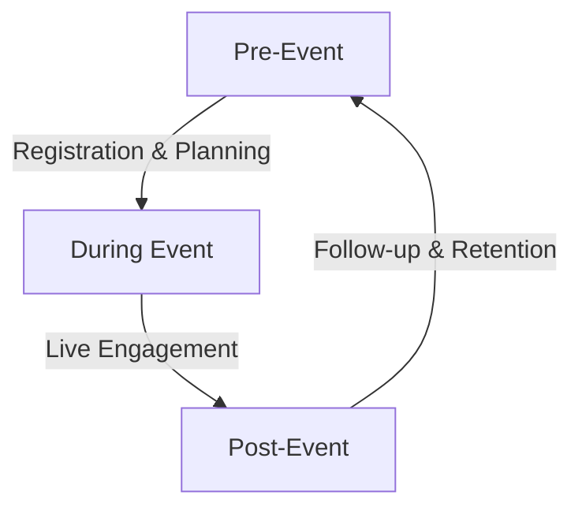

# WhatsApp Integration Strategy for Fashionistas Events Platform

## Executive Summary
Transform the Medellín fashion event experience through WhatsApp integration using Wappbíz API, delivering automated, personalized interactions for all stakeholders in the Colombian fashion ecosystem.

## 💼 Business Impact
| Stakeholder | Benefits | Metrics |
|------------|----------|----------|
| Event Organizers | - Cost reduction in customer service<br>- Faster response times<br>- Automated workflows | - 60% cost reduction<br>- 80% faster responses<br>- 98% message open rates |
| Fashion Professionals | - Instant casting notifications<br>- Schedule coordination<br>- Portfolio sharing | - 45% booking efficiency<br>- 70% faster coordination<br>- 40% more opportunities |
| Attendees | - One-click purchases<br>- Real-time updates<br>- Personalized recommendations | - 40% higher conversions<br>- 90% satisfaction rate<br>- 50% more engagement |
| Sponsors | - Direct audience access<br>- Campaign tracking<br>- Lead generation | - 45% retention rate<br>- 35% revenue growth<br>- 60% lead increase |

## 🎭 Communication Workflows

### Event Lifecycle


### Key Touchpoints
1. **Pre-Event**
   - Event catalog & registration
   - Digital ticket delivery
   - Reminders & preparations
   - Casting & coordination

2. **During Event**
   - QR code check-in
   - Live updates & navigation
   - Emergency support
   - Backstage coordination

3. **Post-Event**
   - Feedback collection
   - Media sharing
   - Future opportunities
   - Community engagement

## 🛠️ Technical Implementation

### Wappbíz API Integration
```json
{
  "base_url": "https://api.wapp.biz/api/external",
  "core_features": {
    "messaging": ["templates", "media", "interactive"],
    "automation": ["scheduling", "triggers", "flows"],
    "analytics": ["tracking", "reporting", "insights"]
  },
  "requirements": {
    "availability": "99.9%",
    "response_time": "< 5s",
    "scalability": "100k msgs/day"
  }
}
```

### Message Templates

1. **Event Registration (Spanish)**
```
¡Bienvenido a [Event Name]! 🎉

📅 Fecha: [Date]
⏰ Hora: [Time]
📍 Lugar: [Venue]

Tu código de ticket: [Ticket ID]
[QR Code]

¿Preguntas? ¡Estamos aquí para ayudarte!
```

2. **Casting Call (Bilingual)**
```
🎭 Nueva Oportunidad de Casting / New Casting Opportunity

Evento/Event: [Event Name]
Fecha/Date: [Date]
Requisitos/Requirements:
- [Requirement 1]
- [Requirement 2]

Para aplicar/To apply: "APLICAR"/"APPLY"
```

3. **Payment Confirmation**
```
✅ Pago Confirmado / Payment Confirmed

Monto/Amount: [Amount]
Evento/Event: [Event Name]
ID: [Order Number]

Tu ticket digital llegará pronto / Your digital ticket is on its way
```

### API Endpoints & Authentication

1. **Template Messages**
```json
POST /sendTemplate?apikey={{apikey}}
{
  "name": "Maria Rodriguez",
  "phone": "573001234567",
  "template_id": "EVENT_CONFIRMATION",
  "parameters": "Medellín Fashion Week 2024, MFW2024-001"
}
```

2. **Media Messages**
```json
POST /sendTemplateWithDoc?apikey={{apikey}}
{
  "name": "Carlos Sanchez",
  "phone": "573009876543",
  "template_name": "QR_TICKET",
  "parameters": "Desfile de Moda Primavera 2024",
  "base64_id": "data:image/png;base64,QR_CODE_IMAGE"
}
```

3. **Scheduled Messages**
```json
POST /sendTemplateWithSchedule?apikey={{apikey}}
{
  "name": "Ana Martinez",
  "phone": "573005555555",
  "template_id": "REMINDER",
  "parameters": "Tomorrow's Fashion Show",
  "schedule_at": "2024-03-15 10:00:00"
}
```

### Error Handling
```json
{
  "message": "Error description",
  "status": 4XX/5XX,
  "error": true,
  "details": {
    "code": "ERROR_CODE",
    "description": "Detailed error message"
  }
}
```

## 🎨 Enhanced Features

### Virtual Fashion Assistant
1. **Style Services**
   - Personal styling recommendations
   - Outfit coordination
   - Trend analysis
   - Shopping suggestions
   - Color matching

2. **Event Experience**
   - AR venue preview
   - Virtual fitting room
   - Digital showroom
   - Live collection viewing
   - Interactive catalogs

### Community Features
1. **Networking**
   - Professional connections
   - Interest groups
   - Event buddies
   - Designer collaborations
   - Industry updates

2. **Social Integration**
   - Photo sharing
   - Live stories
   - Event highlights
   - Behind-the-scenes content
   - Influencer partnerships

## 🔒 Security & Compliance

### Technical Requirements
- End-to-end encryption
- Token authentication
- Rate limiting
- DDoS protection
- Audit logging

### Compliance
- Colombian data laws
- WhatsApp policies
- GDPR standards
- Local regulations

## 📈 Implementation Phases

| Phase | Duration | Focus | Deliverables |
|-------|----------|-------|--------------|
| Foundation | 2 weeks | Basic setup & templates | API integration, core flows |
| Core Features | 2 weeks | Ticketing & notifications | Payment system, automations |
| Advanced | 2 weeks | AI & analytics | Chatbot, dashboards |
| Optimization | 2 weeks | Performance & scale | Monitoring, improvements |

## 📊 Success Metrics
| Category | Metric | Target |
|----------|--------|--------|
| Messages | Delivery rate | >95% |
| Response | Time | <2 min |
| Engagement | User activity | >80% |
| Support | Resolution rate | >90% |
| Sales | Conversion | +40% |
| Cost | Reduction | -60% |

## 🔄 Best Practices
1. **Message Design**
   - Clear, concise content
   - Bilingual (Spanish/English)
   - Rich media optimization
   - Cultural sensitivity

2. **Technical Operations**
   - Regular monitoring
   - Performance optimization
   - Backup procedures
   - Documentation maintenance

3. **Security**
   - API key rotation
   - Request logging
   - IP whitelisting
   - Regular audits

This integration prioritizes user experience, system reliability, and seamless operation while maintaining high security and performance standards for the Medellín fashion industry.

## 📱 Integration Use Cases

### Fashion Events
1. **Runway Shows**
   - Digital invitations
   - Seating assignments
   - Backstage coordination
   - Live updates
   - Post-show feedback

2. **Fashion Markets**
   - Vendor registration
   - Booth assignments
   - Visitor guides
   - Sales tracking
   - Vendor analytics

3. **Design Workshops**
   - Registration management
   - Material requirements
   - Schedule updates
   - Portfolio sharing
   - Certificate delivery

### Stakeholder Management
1. **Designers**
   - Collection submissions
   - Show schedules
   - Model assignments
   - Technical requirements
   - Sales reports

2. **Models**
   - Casting calls
   - Fitting schedules
   - Show lineups
   - Payment tracking
   - Portfolio updates

3. **Sponsors**
   - Partnership proposals
   - Brand integration
   - Performance metrics
   - Audience insights
   - ROI reports
